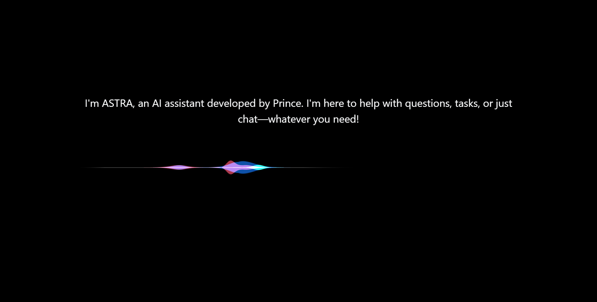

# 🚀 ASTRA A.I. Voice Assistant

## 📸 Project Overview

<table align="center">
  <tr>
    <td style="border: 2px solid #00aaff; border-radius: 12px; padding: 6px;">
      
    </td>
    <td style="border: 2px solid #00aaff; border-radius: 12px; padding: 6px;">
      
    </td>
  </tr>
</table>

  <strong>🎙️ An intelligent desktop voice assistant designed to interact with users through natural voice commands.</strong>

---

## ⚡ Project Highlights

| 🚀 Specification           |            📊 Details |
| -------------------------- | --------------------: |
| 🎙️ Voice-Enabled Commands |               **20+** |
| 🧪 Commands Tested         |               **50+** |
| 🖥️ Desktop Assistant      | **1 Complete System** |
| 🔊 Voice Interaction       |         **Real-Time** |
| 🤖 AI-Powered Automation   |    **Multiple Tasks** |
| 🌐 Web Integration         |               **Yes** |
| 💾 Local Data Storage      |            **SQLite** |

### 🎯 Key Capabilities

* 🎙️ **20+ voice-enabled commands** for interacting with the assistant.
* 🧪 **Tested across 50+ voice commands** to validate voice interaction and command handling.
* 🖥️ Real-time desktop voice interaction.
* 🔊 Speech-to-Text and Text-to-Speech capabilities.
* 🌐 Web and application automation.
* 📱 WhatsApp messaging integration.
* ▶️ YouTube interaction through voice commands.
* 💾 SQLite-based local data management.
* 🎨 Interactive desktop interface.

> 🚀 **ASTRA combines voice recognition, AI-driven command processing, automation, and a modern interface into one complete desktop assistant.**

## **🤖 Artificial Intelligence**

* 🧠 AI-powered conversational assistant
* 💬 Natural language understanding
* 🎯 Intelligent command processing
* 📝 Context-aware responses
* ⚡ Fast command execution
* 🔄 Fallback AI chat for general questions

## **🎙️ Voice Interaction**

* 🎤 Speech-to-Text (STT)
* 🔊 Text-to-Speech (TTS)
* 🗣️ Natural voice responses
* 🎧 Microphone-based voice command recognition
* ⚡ Real-time voice processing
* 🔁 Continuous listening mode (when enabled)

## **💻 Desktop Automation**

* 📂 Open desktop applications
* 🖥️ Launch system software
* 🌐 Open websites instantly
* 🔍 Search anything on Google
* 📄 Execute custom desktop commands
* ⚙️ Automate repetitive computer tasks

## **🌍 Internet Features**

* 🔎 Google Search
* 📺 YouTube Search
* 🎵 Play songs on YouTube
* 🌐 Website navigation
* 📚 AI-powered information retrieval

## **💬 Communication**

* 📱 WhatsApp message automation
* 👥 Contact recognition
* 💌 Send messages using voice commands
* 📞 Smart contact search

## **📂 File & System Control**

* 📁 Open folders
* 📄 Open files
* 🗑️ System command execution
* ⚡ Quick access to applications
* 🖥️ Windows integration

## **🧠 Face Recognition & Authentication**

* 😀 Face detection
* 🔐 Secure face authentication
* 👤 User recognition
* 📸 Face model training
* 🧬 Facial data management

## **🎨 User Interface**

* ✨ Modern AI-inspired interface
* 🌙 Dark theme design
* 💫 Animated assistant messages
* 🎵 Startup sound effects
* 🖱️ Interactive controls
* 📱 Responsive layout

## **⚡ Performance**

* 🚀 Fast startup
* ⚙️ Optimized command execution
* 🧹 Modular architecture
* 🔄 Background task handling
* 💾 Lightweight SQLite database

## **🗃️ Database**

* 💾 SQLite database
* 👤 Contact management
* 📝 Configuration storage
* ⚡ Efficient local data management

## **🔒 Security**

* 🔐 Face authentication
* 🛡️ Local data storage
* 🔑 Environment variable support
* 🚫 Sensitive files protected using `.gitignore`

## **🛠️ Technologies Used**

* 🐍 Python 3
* 🌐 HTML5
* 🎨 CSS3
* ⚡ JavaScript
* 🔗 Eel Framework
* 💾 SQLite
* 🎤 SpeechRecognition
* 🔊 pyttsx3
* ▶️ PyWhatKit
* 🤖 Hugging Face Integration
* 🎧 PyAudio
* 🖱️ PyAutoGUI
* 📷 OpenCV
* 🧠 Face Recognition libraries

## **📦 Architecture**

* 📁 Modular project structure
* 🧩 Separate engine components
* 🔌 Easy to extend
* ⚙️ Configuration-based design
* 📂 Organized Python packages

## **🎯 Smart Commands**

* 🗣️ Voice commands
* 🔍 Search commands
* 📺 Play media
* 🌐 Open websites
* 💬 Send WhatsApp messages
* 📂 Launch applications
* 🧠 AI conversation
* ❓ Answer general questions

## **✨ User Experience**

* 🎙️ Hands-free interaction
* ⚡ Minimal response time
* 🤝 Beginner-friendly interface
* 🎯 Easy-to-use controls
* 🌟 Smooth animations
* 💡 Human-like conversation

# **📊 Project Highlights**

* 🚀 AI-powered desktop assistant
* 🎙️ Voice-controlled interaction
* 🤖 Natural language conversations
* 🔐 Face authentication system
* 💬 WhatsApp automation
* 🌐 Web browsing & searching
* 📺 YouTube integration
* 🖥️ Desktop automation
* 💾 SQLite database support
* 🎨 Modern responsive UI
* ⚡ High-performance modular architecture
* 🛡️ Secure and extensible design

# **🌟 Future Enhancements**

* 📅 Calendar & reminders
* 📧 Email automation
* 🌤️ Weather updates
* 📰 News briefing
* 🎵 Spotify integration
* 🏠 Smart home (IoT) control
* 📱 Mobile companion app
* 🌍 Multi-language support
* ☁️ Cloud synchronization
* 🧠 Long-term conversation memory

## 👨‍💻 Author

**PrinceBuildsAI**

Built as a practical **AI-powered voice assistant project** to explore how voice recognition, natural language interaction, and desktop automation can be combined to create an intelligent personal assistant.

---

⭐ **If you found this project interesting, consider giving the repository a star!**

